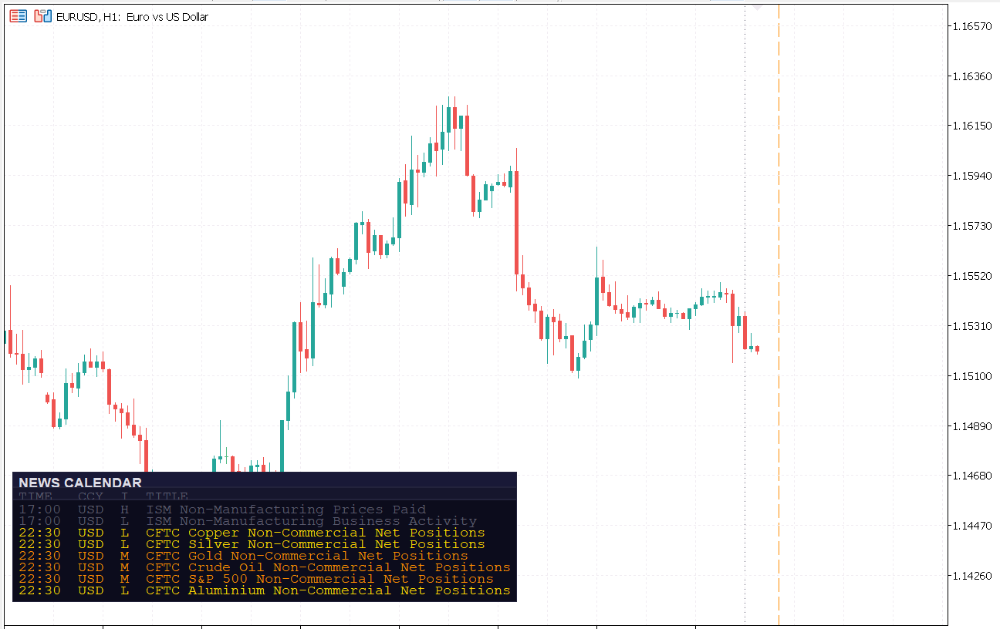
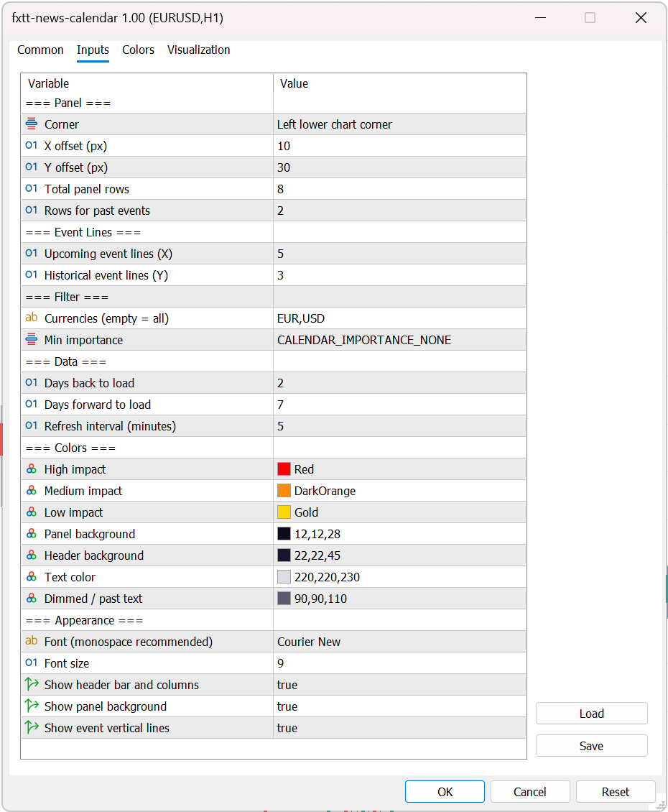
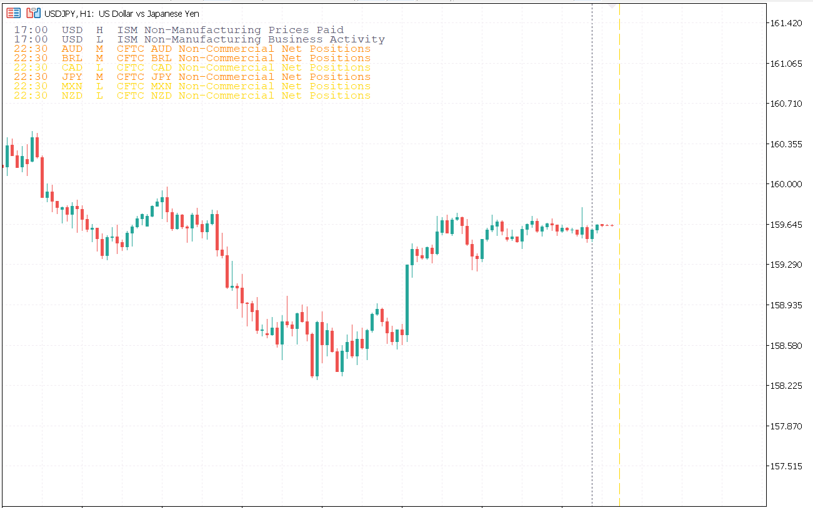

# FXTT News Calendar MT5 — Economic Calendar Indicator for MetaTrader 5

> **Free MT5 indicator.** Display a live economic calendar panel and colour-coded vertical event lines directly on your MetaTrader 5 chart — powered by the MT5 built-in calendar API, no external data feed required.

[](#compatibility)
[](#license)
[](#changelog)
[](#compatibility)

---



---

## Table of Contents

- [Overview](#overview)
- [Features](#features)
- [Installation](#installation)
- [Settings Reference](#settings-reference)
- [How to Use](#how-to-use)
- [Compatibility](#compatibility)
- [Changelog](#changelog)
- [License](#license)

---

## Overview

**FXTT News Calendar MT5** is a free economic calendar indicator for MetaTrader 5. It reads event data directly from the broker's built-in calendar feed — no web requests, no third-party services, no API keys — and presents it in two complementary ways:

- **Panel** — a compact overlay listing upcoming and recent events with time, currency, impact level, and title.
- **Vertical lines** — colour-coded chart lines that mark each event's exact timestamp so you can see at a glance when news is approaching or has just passed.

The panel position, row counts, currency filter, minimum impact level, colours, and refresh rate are all configurable without touching the source code.

**Who it is for:** Traders who need to stay aware of high-impact news while managing open positions or waiting for entries — without switching away from their execution chart.

---

## Features

| Feature | Detail |
|---|---|
| **No external data feed** | Uses the MT5 built-in `CalendarValueHistory` API — works on any broker |
| **Live panel overlay** | Shows upcoming and recent events with time, currency, impact, and title |
| **Vertical event lines** | Colour-coded lines at each event time, with tooltip showing currency, impact, and relative offset |
| **Impact colour coding** | High · Medium · Low — each with its own configurable colour |
| **Currency filter** | Show only the currencies you trade (e.g. `USD,EUR,GBP,JPY`) |
| **Minimum importance filter** | Hide Low or Medium events to reduce noise |
| **Auto-refresh** | Reloads calendar data on a configurable timer (default 5 minutes) |
| **4 panel corners** | Anchor the panel to any chart corner with pixel-level X/Y offset control |
| **Separate row counts** | Configure upcoming and historical row counts independently for the panel and vertical lines |
| **Transparent panel mode** | Disable the panel background for a cleaner chart look |
| **Past event dimming** | Historical events are displayed in a muted colour to distinguish them from upcoming ones |
| **VPS compatible** | Runs persistently on a VPS without interfering with Expert Advisors |

---

## Installation

### Requirements

- MetaTrader 5 (any build)
- Windows, macOS (via Wine/CrossOver), or VPS

### Steps

1. **Download** the `.zip` file from the [Releases](../../releases) section or from the [product page](https://forextradingtools.eu).
2. **Extract** the zip — you will find `fxtt-news-calendar-mt5.ex5` inside.
3. In MetaTrader 5, go to **File → Open Data Folder**.
4. Navigate to **MQL5 → Indicators** and paste the `.ex5` file there.
5. Back in MT5, press **Ctrl+N** to open the Navigator panel, then right-click **Indicators → Refresh**.
6. Double-click the indicator in the Navigator, or drag it onto any chart to attach it.
7. Configure your settings in the Inputs tab and click OK.

### VPS Installation

Copy the `.ex5` file to the same `MQL5 → Indicators` path on your VPS instance of MT5. The indicator runs persistently and refreshes the calendar data on schedule even when your local computer is offline.

### Saving Your Settings as a Template

Once configured, right-click the chart → **Template → Save Template** to preserve your currency filter, colours, and layout preferences across sessions and chart changes.

### Updating to a New Version

1. Detach the indicator from any charts, or close those charts.
2. Replace the old `.ex5` file in `MQL5/Indicators` with the new one.
3. Restart MT5 or right-click → Refresh in the Navigator.
4. Re-attach the indicator — your saved templates will restore all previous settings.

### Troubleshooting

| Problem | Solution |
|---|---|
| No events appear in the panel | Ensure your broker provides calendar data. Open MT5 Calendar tab (`View → Economic Calendar`) to verify events are available. |
| Panel not visible on chart | The panel may be outside the visible area. Reset its position via the **Corner**, **X Offset**, and **Y Offset** inputs. |
| Stale or missing events after a reconnect | The data refreshes automatically on the next timer tick. Force a refresh by removing and re-adding the indicator, or reduce the **Refresh interval** input. |
| Indicator not visible in Navigator after refresh | Confirm the file is in `MQL5/Indicators` (not a subfolder). Copy the `.ex5` file, not just the `.mq5` source. |
| "Invalid ex5" error in MT5 | Re-download the file — the zip may have been corrupted. Open an issue if the problem persists. |

---

## Settings Reference



All parameters are in the **Inputs** tab of the indicator settings window. Open it by double-clicking the indicator in the Navigator, or right-clicking the chart → **Indicators List → Edit**.

### Panel

| Parameter | Default | Description |
|---|---|---|
| **Corner** | Bottom-Left | Chart corner the panel anchors to. |
| **X Offset** | 10 px | Horizontal distance from the selected corner. |
| **Y Offset** | 30 px | Vertical distance from the selected corner. |
| **Total panel rows** | 8 | Maximum number of data rows (upcoming + historical) shown in the panel. |
| **Rows for past events** | 2 | How many of the total rows are reserved for recently passed events. |

### Event Lines

| Parameter | Default | Description |
|---|---|---|
| **Upcoming event lines** | 5 | Number of future events to mark with a vertical line on the chart. |
| **Historical event lines** | 3 | Number of past events to mark with a dotted vertical line on the chart. |

### Filter

| Parameter | Default | Description |
|---|---|---|
| **Currencies** | `USD,EUR,GBP,JPY,AUD,CAD,CHF,NZD` | Comma-separated list of currencies to show. Leave empty to show all. |
| **Min importance** | Moderate | Events below this level are hidden. Options: Low, Moderate, High. |

### Data

| Parameter | Default | Description |
|---|---|---|
| **Days back to load** | 2 | How many calendar days of history to fetch. |
| **Days forward to load** | 7 | How many calendar days ahead to fetch. |
| **Refresh interval (minutes)** | 5 | How often the calendar data is reloaded from the broker. |

### Colors

| Parameter | Default | Description |
|---|---|---|
| **High impact** | Red | Line and panel text colour for High-importance events. |
| **Medium impact** | Dark Orange | Line and panel text colour for Moderate-importance events. |
| **Low impact** | Gold | Line and panel text colour for Low-importance events. |
| **Panel background** | `C'12,12,28'` | Background fill of the panel. |
| **Header background** | `C'22,22,45'` | Background fill of the title and column-header rows. |
| **Text color** | `C'220,220,230'` | Default text colour for upcoming events and column headers. |
| **Dimmed / past text** | `C'90,90,110'` | Text and line colour for historical (past) events. |

### Appearance

| Parameter | Default | Description |
|---|---|---|
| **Font** | Courier New | Panel font. A monospace font keeps columns aligned. |
| **Font size** | 9 | Panel font size in points. |
| **Show header bar and columns** | true | Toggle the title bar and TIME / CCY / I / TITLE column headers. |
| **Show panel background** | true | Toggle the panel background rectangle. Disable for a transparent overlay. |
| **Show event vertical lines** | true | Toggle all vertical event lines on the chart. |

---

## How to Use

### Reading the Panel

The panel lists events in chronological order — oldest historical events at the top, followed by upcoming events. Each row shows:

```
HH:MM  CCY  I  Event title
```

- **HH:MM** — Event time in the chart's timezone.
- **CCY** — The currency affected (e.g. `USD`, `EUR`).
- **I** — Impact level: `H` (High), `M` (Moderate), `L` (Low).
- **Title** — Short event name (e.g. `NFP`, `CPI y/y`).

Past events are displayed in a muted colour. Upcoming events use the impact colour so you can identify high-risk events at a glance.

### Reading the Vertical Lines

Each vertical line is drawn at the exact event timestamp:

- **Dashed line** — an upcoming event; colour reflects impact level (red = High, orange = Medium, gold = Low).
- **Dotted line** — a past event; always displayed in the dimmed colour.

Hover over any line to see its tooltip: relative time offset (e.g. `+2h15m`), currency, impact, and title.

### Avoiding News Spikes

1. Identify upcoming High-impact events (red dashed lines) in the next 30–60 minutes.
2. Close or reduce position size before the event if you are not comfortable holding through volatility.
3. Wait for the initial spike to settle before entering new positions near the event time.

### Staying in Trades Through Low-Impact Events

Low- and Medium-impact events (gold and orange lines) rarely cause lasting price moves. Use the filter inputs to hide Low events entirely and focus on Moderate and High events only if you prefer a cleaner chart.

### Combining with Other Indicators

The News Calendar works as a **timing and risk-awareness tool** alongside technical indicators:

- **Moving averages / trend indicators** — confirm trade direction, then use the calendar to avoid entering just before major news.
- **Bollinger Bands / ATR** — check whether implied volatility is already elevated heading into a news event.
- **Support & Resistance** — be aware that key levels near a high-impact event may be tested aggressively on the release.

> **Note:** The indicator does not generate buy or sell signals. Entry and exit decisions remain with the trader.

### Transparent Panel

Disable **Show panel background** for a cleaner look that blends with dark or custom chart themes. The text and lines remain fully visible.



---

## Compatibility

| | |
|---|---|
| **Platform** | MetaTrader 5 (all builds) |
| **Calendar source** | MT5 built-in broker calendar — no external feed required |
| **Operating System** | Windows · macOS (via Wine/CrossOver) · VPS |
| **Instruments** | Forex pairs · Gold (XAUUSD) · Indices (US30, NAS100, DE40…) · Crypto (BTCUSD, ETHUSD…) · All MT5-supported symbols |
| **Timeframes** | All (M1 to MN1) — the panel and lines adapt to any chart timeframe |
| **Expert Advisors** | Compatible — the indicator is visual only and does not interfere with EAs |
| **MT4** | Not compatible — MT4 does not have a built-in calendar API |

---

## Changelog

| Version | Date | Notes |
|---|---|---|
| **1.00** | April 2026 | Initial release. Live panel overlay, colour-coded vertical event lines, currency and importance filters, configurable corners and row counts, transparent panel mode, auto-refresh on configurable timer. |

**Update policy:** All updates are free. Replace the `.ex5` file in `MQL5/Indicators` with the new version and refresh the Navigator. Your saved templates preserve all custom settings across updates.

---

## License

This indicator is provided **free of charge** for personal use. You may use it on any number of MT5 accounts and VPS instances. Redistribution, resale, or repackaging without written permission is not permitted.

© [Forex Trading Tools](https://forextradingtools.eu) — All rights reserved.

---

*Found a bug or have a feature request? Open an [issue](../../issues) or use the suggestion form on the [product page](https://forextradingtools.eu).*